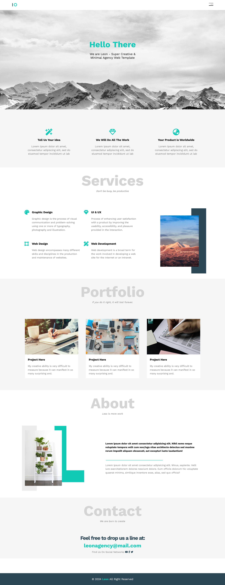

# Responsive Web Agency Template ✌

## Table of contents

- [Overview](#overview)
  - [Screenshot](#screenshot)
  - [Links](#links)
- [My process](#my-process)
  - [Built with](#built-with)
    - [HTML Structure](#1-html-structure)
    - [Main Content](#2-main-content)
    - [CSS Styling](#3-css-styling)
    - [Media Queries](#4-media-queries)
- [Author](#author)

## Overview

### Screenshot

### Links

- GitHub Repo: [Solution](https://github.com/basemsameh/Responsive-Web-Agency-Template.git)
- Live Site URL: [Demo](https://basemsameh.github.io/Responsive-Web-Agency-Template/#services)

## My process

### Built with:

#### (1) HTML Structure:
- Header: Contains a navigation bar and a welcome section with a logo, 
navigation links, and a headline.

#### (2) Main Content:
- Section One: Details section with three subsections.
- Section Two (Services): Displays different services offered by the agency.
- Section Three (Portfolio): Displays a portfolio of projects.
- Section Four (About): Provides information about the agency.
- Section Five (Contact): Contains contact information.
- Footer: Contains copyright information.

#### (3) CSS Styling:
- Global Reset: Resets default margin and padding for elements.
- Variables: Defines CSS custom properties for colors and other values.
- Typography: Sets the font family for the entire document.
- Header Styling: Styles the header, including the navigation bar and welcome section.
- Navbar Styling: Styles the navigation bar and its links.
- Home Page Styling: Styles the welcome section.
- Main Section Styling: Styles the main content sections.
- Services, Portfolio, About, Contact Sections Styling: Styles each section individually.
- Footer Styling: Styles the footer.

#### (4) Media Queries:
- Adjusts the layout and styling for different screen sizes using media queries.
- Enhances responsiveness by changing layout and font sizes for larger screens.

## Author

- Linkedin - [Basem Sameh](https://www.linkedin.com/in/basem-sameh-671b5b212/)